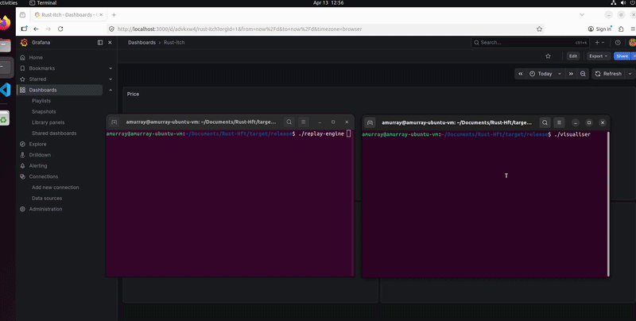

# Demo High-Frequency Trading (HFT)

A low-latency, high-frequency trading (HFT) demo project. This project implements a zero-allocation network ingestion path, parsing raw binary NASDAQ ITCH v5.0 market data into stack-allocated structures, implementing a localized risk firewall, and routing orders via lock-free shared memory to an execution gateway.

This repository aims to serve as a comprehensive demonstration and introduction to the following concepts:

 - Quantitative systems engineering.
 - Market microstructure mechanics.
 - Low-latency systems programming.

There has been a concerted effort to place inline code comments to assist in bridging domain knowledge.

  

## 🏗️ Overview

All components are coded in Rust, except for the execution engine which is C++. There is a zero-allocation hot-path with cache-line aligned (64-byte) structures and OS page pre-faulting.
Asynchronous batching to InfluxDB, displayed in a Grafana UI.

### ⚙️ Components

#### 1. Market Handler
Unpacks raw binary UDP network packets into Rust structs without heap allocations on the network ingestion path. Maintains an `O(1)` HashMap for discrete order cancellations (L3) and a `BTreeMap` for best bid + best offer spread calculations (L2). Enforces maximum order sizes, limits total inventory exposure, and blocks orders with prices that are too far away from the current market.
*Note: The use of standard `HashMap` and `BTreeMap` introduces runtime heap-allocation jitter. For this demo, these  were selected for simplicity; in a production setup, these would not be used.*

#### 2. Lock free IPC bridge
 An optimized memory-mapped (`mmap`) ring buffer acting as the execution and telemetry bridge.
 
#### 3. Execution Gateway (C++)
Processes orders from Rust market handler. Coalesces and frames fragmented execution reports before writing them back to the Rust strategy engine via inbound shared memory.

#### 4. Telemetry
An isolated core reads the lock-free ring buffer and micro-batches time-series line protocol to InfluxDB.  Real-time calculation of realized cash against unrealized inventory liabilities. 

#### 5. Simulation
A lightweight TCP server that simulates a live exchange, accepting inbound orders from the C++ gateway and returning `ExecutionReport` fills.  A network test harness that replays hex-encoded ITCH 5.0 packets over localhost, triggering the Rust engine's hot-path logic and validating the end-to-end network stack.

#### 6. Modularity & Trait-Based Design
The `MarketState` and `SymbolProcessor` logic are designed as pure library components, completely decoupled from their I/O sources. By relying on Rust traits (`ExchangeGateway`, `MessageAnalyticsWriter`), the system  swaps between the live application (reading UDP, routing via IPC) and the replay application (memory-mapping historical files, simulated internal routing) with zero runtime overhead or code duplication. Replay engine does not handle ghost orders.

## 📊 System Demonstrations

Demonstration of the live Rust engine routing orders, capturing fills, and feeding the Grafana HFT Command Center in real-time (use incognito/private browser )

[Rust-hft-demo][HftDemo](https://1drv.ms/f/c/f025b7270efe03cd/IgD0FyvZ7MI2Qp6tsgrdaSQVAdVp3eO64vS0nFttGc1wGFU?e=SR90R1)

---

## 📝 Strategy Logic: Simple Midpoint
This is a latency-sensitive liquidity-taking model. It monitors the structural weight of the L2 book (Order Book Imbalance) alongside fair value drift. If buyers possess >80% of the visible volume and the midpoint is drifting upward, the algorithm fires an Immediate-or-Cancel (IOC) order to cross the spread before the resistance collapses. In simple terms: if there is a whole bunch of buyers with very few sellers, send a buy order.

### 🤖 The Role of AI Here
Is this all AI-generated? The answer is No. If you ask an LLM to generate a full "HFT system," it won't do it. There are far too many implementation variations. However, it can code individual components quite well. 

I extensively used AI for domain knowledge here. In these types of learning projects, AI excels at imparting crucial "how systems work" knowledge—the type of knowledge that is primarily gained from actually working in the area. AI saves you from reading through a multitude of different webpages, articles, papers, videos, etc., and floundering while trying to amalgamate the information. It was a great help with Rust in general and provided extremely good code review comments.